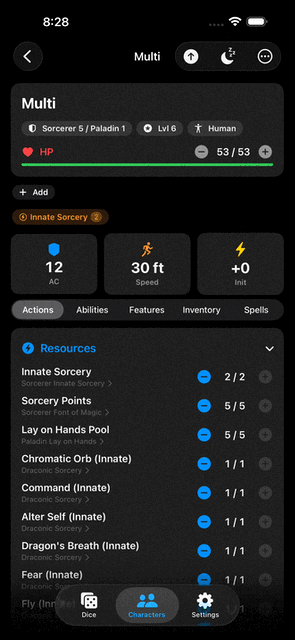
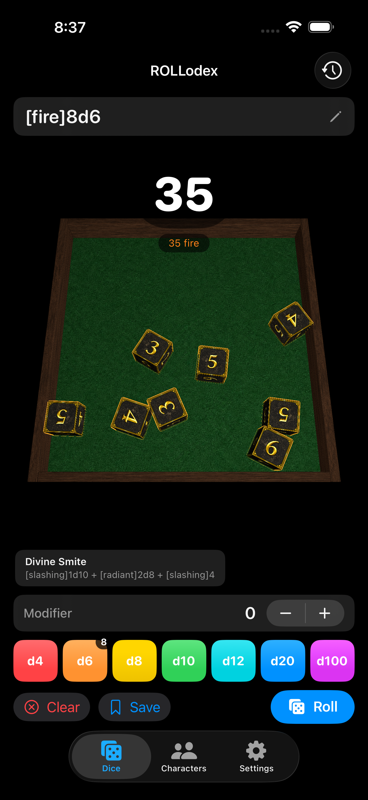
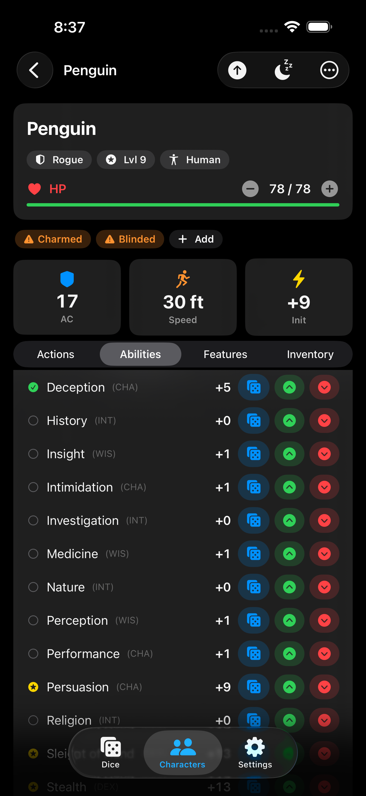
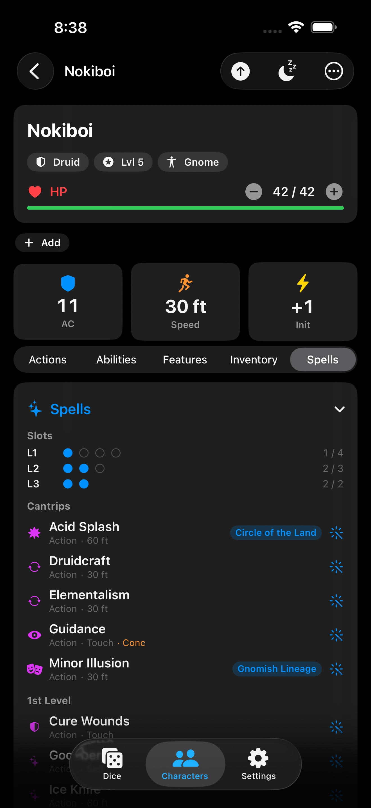
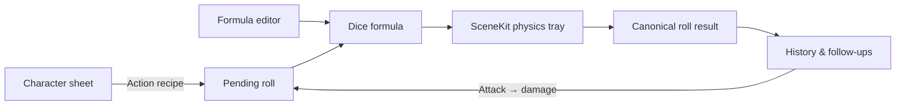

# ROLLodex

<div align="center">

**A native iOS tabletop companion for character management and satisfyingly physical dice rolls.**

[](https://developer.apple.com/ios/)
[](https://www.swift.org/)
[](https://developer.apple.com/swiftui/)
[](https://developer.apple.com/scenekit/)
[](https://www.dndbeyond.com/srd)

_ROLLodex combines **ROLL** with a Rolodex: the dice and the characters behind them, together in one app._

</div>

---

<div align="center">
  <p align="center">
    
  </p>
</div>

---

## What is ROLLodex?

ROLLodex is an offline-first SwiftUI app for fifth-edition tabletop play. It pairs a SceneKit-powered 3D dice tray with a data-driven character sheet, so an attack, saving throw, spell, class feature, or item use can flow directly from a character into the roller.

There are no accounts, analytics, network services, package dependencies, or subscription features. Dice state stays on the device, while characters are stored as portable JSON documents.

## Highlights

### Physics-based 3D dice

- Roll d4, d6, d8, d10, d12, d20, and percentile dice in a wood-and-felt SceneKit tray.
- Procedural geometry, textured faces, real collision physics, and automatic rest detection.
- Advantage, disadvantage, keep/drop, reroll-once, minimum-value floors, and flat modifiers.
- Damage-type coloring and per-type result breakdowns for mixed-damage rolls.
- Press and hold a settled die for a top-down magnified view.
- Save favorite formulas as presets and revisit up to 200 persisted history entries.
- Follow-up actions keep combat moving: attack → damage, Sneak Attack, Rage, Divine Smite, and other eligible riders.

### A character sheet that plays at the table

- Guided character creation with species, background, class, ability scores, proficiencies, equipment, and starting spells.
- All 12 SRD 5.2.1 classes with one SRD subclass per class, level progression through 20, and multiclass support.
- Live derived stats for HP, AC, initiative, speed, saves, skills, passive Perception, attacks, and spellcasting.
- Actions, abilities, features, inventory, and spells organized into focused sheet tabs.
- Resource pools, short and long rests, spell slots, Pact Magic, concentration, conditions, active effects, and death saves.
- Level-up workflows for HP, new features, subclasses, ability-score improvements, spell growth, and multiclass choices.
- Character-aware rolls hand the correct formula, mode, damage type, follow-ups, and resource costs to the dice tab.
- Import and export characters as JSON; import homebrew content packs that can extend or override bundled content by ID.

## Screenshots

<p align="center">
  
  &nbsp;
  
  &nbsp;
  
</p>

## Roll more than `1d20`

The formula editor understands familiar tabletop notation plus ROLLodex-specific typed damage:

| Formula | Meaning |
|---|---|
| `1d20+5` | A d20 check with a +5 modifier |
| `2d20kh1` | Roll with advantage; keep the highest die |
| `4d6dl1` | Roll four d6 and drop the lowest |
| `2d6r1` | Reroll each die showing 1 once |
| `1d20min10` | Apply a minimum face value of 10 |
| `[fire]2d6+[necrotic]1d8+3` | Roll and subtotal multiple damage types |

Kept dice remain prominent after the roll, while dropped dice dim in the tray. Percentile rolls use a paired tens-and-ones d10 presentation.

## Bundled game content

The current catalog is sourced from SRD 5.2.1 content and loaded from JSON at runtime:

| Content | Bundled |
|---|---:|
| Classes | 12 |
| Subclasses | 12 |
| Species | 9 |
| Backgrounds | 4 |
| Spells | 339 |
| Feats | 17 |
| Weapons | 38 |
| Armor | 8 |
| Conditions | 15 |

The engine is deliberately content-driven. Classes, species, backgrounds, feats, spells, weapons, armor, gear, and conditions decode into plain Swift models, and imported JSON packs overlay matching bundled IDs without modifying the app bundle.

## How the pieces connect



- SwiftUI views hold local presentation state and consume shared `@Observable` stores from the environment.
- Pure Swift calculators, parsers, interpreters, and resolvers keep game logic testable without UI frameworks.
- Dice history and presets use `UserDefaults`; characters and imported content use JSON files under the app's Documents directory.
- Character-derived actions cross tabs through `PendingRollStore`, preserving labels, roll mode, costs, damage types, and follow-up rolls.

## Requirements

- macOS with Xcode 26.4 or a compatible newer release
- iOS 18.0+ device or simulator
- No CocoaPods, SwiftPM packages, API keys, or external services

## Getting started

1. Clone the repository:

   ```bash
   git clone https://github.com/hozerapha/dndtools_ios.git
   cd dndtools_ios
   ```

2. Open the Xcode project:

   ```bash
   open ROLLodex/ROLLodex.xcodeproj
   ```

3. Select the **ROLLodex** scheme and an iOS 18+ simulator.
4. Press **⌘R** to build and run.

The app target uses bundle identifier `com.jcol.ROLLodex`. Running in the iOS Simulator does not require a paid Apple Developer account.

## Tests

The test target uses [Swift Testing](https://developer.apple.com/xcode/swift-testing/) rather than XCTest. Coverage includes dice formulas and parsing, roll aggregation, persistence, character calculations, content decoding and validation, actions, resources, spells, conditions, multiclassing, level-up behavior, and class mechanics.

From the command line, first find a simulator UDID:

```bash
xcrun simctl list devices available
```

Then run the suite with scratch DerivedData:

```bash
xcodebuild \
  -project ROLLodex/ROLLodex.xcodeproj \
  -scheme ROLLodex \
  -configuration Debug \
  -destination 'platform=iOS Simulator,id=<SIMULATOR_UDID>' \
  -derivedDataPath /tmp/rollodex-dd \
  test
```

## Project layout

```text
ROLLodex/
├── ROLLodex.xcodeproj/
├── ROLLodex/
│   ├── App/                         # Root tab shell and store injection
│   ├── Features/
│   │   ├── DiceRoller/              # Models, persisted state, SwiftUI + SceneKit
│   │   └── CharacterSheet/          # Models, content engine, stores, and views
│   ├── Resources/Content/           # Bundled SRD JSON
│   ├── Assets.xcassets/             # Dice faces and tray textures
│   └── ROLLodexApp.swift
└── ROLLodexTests/                   # Swift Testing suite
```

For the implementation history and upcoming work, see [PLAN.md](PLAN.md) and [PLAN_CharacterSheet.md](PLAN_CharacterSheet.md). Agent-specific repository conventions live in [AGENTS.md](AGENTS.md).

## Project status

The core dice roller and character-manager phases are implemented and usable. ROLLodex is still under active development: some complex tabletop rules remain descriptive or rely on player confirmation, and features such as cloud sync, online group play, encounter management, a bestiary, localization, and iPad-specific layouts are outside the current scope.

## README media

The showcase above uses these files:

- `Docs/readme/dice-roll.gif` — 4–7 seconds, tightly cropped, with one complete roll and result reveal.
- `Docs/readme/dice-roller.png` — a settled mixed-dice roll with the total visible.
- `Docs/readme/character-sheet.png` — a populated sheet showing HP, AC, speed, and initiative.
- `Docs/readme/spells-actions.png` — the Spells tab or an attack-to-damage handoff.
- Optional: `Docs/readme/rollodex-logo.png` — a transparent wordmark that can replace the text-only title.

For a tidy GitHub page, use simulator captures with the same device, appearance, and crop. Keep the GIF under roughly 10 MB so the README loads quickly.

## Contributing

Issues and focused pull requests are welcome. Keep model logic independent of SwiftUI and SceneKit, use modern SwiftUI state patterns, add Swift Testing coverage for behavior changes, and avoid adding third-party dependencies without discussing the tradeoff first.

> [!NOTE]
> The Xcode project uses a file-system-synchronized root group. If a new Swift file created outside Xcode does not appear immediately, quit and relaunch Xcode before diagnosing project membership.

## License and attribution

This repository does not currently include a project-wide source-code license. Until one is added, the presence of the source on GitHub should not be interpreted as permission to reuse or redistribute it.

> This work includes material from the System Reference Document 5.2.1 (“SRD 5.2.1”) by Wizards of the Coast LLC, available at https://www.dndbeyond.com/srd. The SRD 5.2.1 is licensed under the Creative Commons Attribution 4.0 International License, available at https://creativecommons.org/licenses/by/4.0/legalcode.

ROLLodex is compatible with fifth edition. It is not affiliated with or endorsed by Wizards of the Coast.
